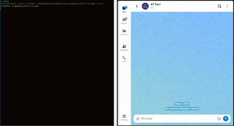
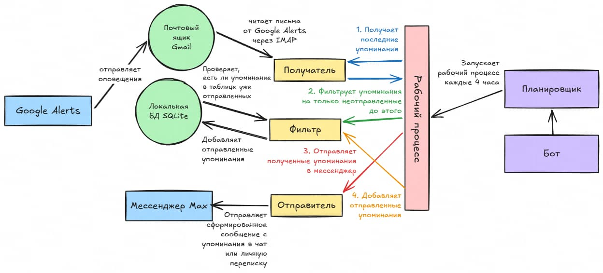

# google-alerts-to-max

Бот, получающий упоминания из Google Alerts и отправляющий их в мессенджер Max

### Демонстрация



### Процесс работы



Бот использует __планировщик__ для запуска __рабочего процесса__ каждые 4 часа

##### Этапы рабочего процесса

1. Получение последних упоминании
    - __Получатель__ ищет последние 10 писем от `googlealerts-noreply@google.com` из _почтового ящика Gmail_
    - __Получатель__ вычитывает из полученных писем упоминания
    - __Получатель__ передает полученные последние упоминания
2. Фильтрация от уже отправленных упоминании
    - __Фильтр__ создает уникальные хэши упоминании
    - __Фильтр__ проверяет какие из хэшей присутствуют в _локальной БД SQLite_
    - __Фильтр__ передает упоминания, которых нет в _локальной БД SQLite_
3. Отправка упоминании
    - __Отправитель__ формирует упоминания в сообщение
    - __Отправитель__ передает сформированное сообщение в _API мессенджера Max_
4. Обновление фильтра
    - __Фильтр__ создает уникальные хэши отправленных упоминании
    - __Фильтр__ добавляет их в _локальную БД SQLite_

### Развертывание

1. Установите [Docker и Docker Compose](https://docs.docker.com/engine/install/) на компьютер/сервер

2. Скачайте `compose.yml` и `.env.example` из репозитория:

```bash
wget -O compose.yml https://raw.githubusercontent.com/synzr/google-alerts-to-max/refs/heads/main/compose.yml
wget -O .env.example https://raw.githubusercontent.com/synzr/google-alerts-to-max/refs/heads/main/.env.example
```

3. Скопируйте/переименуйте `.env.example` в `.env` и отредактируйте переменные

4. Выгрузите все необходимые образы Docker:

```bash
docker compose pull
```

5. Запустите все Docker-контейнеры в фоновом режиме:

```bash
docker compose up -d
```
